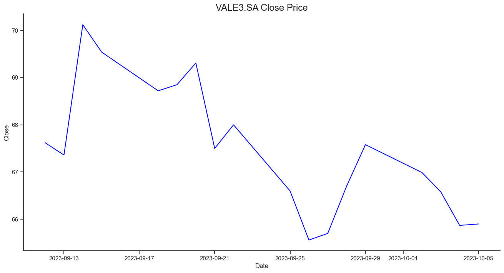
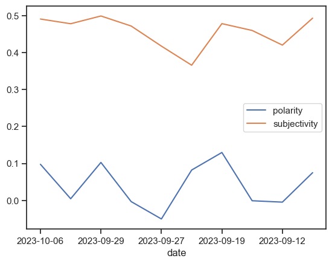

# Analise de Sentimento

## Objetivo

O objetivo deste trabalho foi de aplicar o conhecimento adquirido na disciplina de Aprendizado de Máquina, mais especificamente, na área de PLN (Processamento de Linguagem Natural). Para isso, foi utilizado notícias de três empresas na bolsa de valores pelo site [Yahoo Fincance](https://finance.yahoo.com/) para realizar a análise de sentimento, e então, comparar os valores da bolsa antes e depois das suas respectivas notícias, buscando uma correlação entre o impacto do sentimento trazido na notícia e as negociações daquela mesma empresa.

As empresas escolhidas foram:

- [Itau - ITUB4.SA](https://finance.yahoo.com/quote/ITUB?p=ITUB&.tsrc=fin-srch)
- [Petrobras - PETR4.SA](https://finance.yahoo.com/quote/PBR?p=PBR&.tsrc=fin-srch)
- [Vale - VALE3.SA](https://finance.yahoo.com/quote/VALE3.SA?p=VALE3.SA&.tsrc=fin-srch)

## Metodologia

Para e extração de dados foi utilizado o método de _Web Scraping_ com a biblioteca [Beautiful Soup](https://www.crummy.com/software/BeautifulSoup/bs4/doc/) e a utilização da biblioteca [Selenium](https://www.selenium.dev/documentation/webdriver/), para o _scraping_ de dados renderizados por JavaScript.
Os dados foram armazenados em um arquivo _.csv_, utilizando a biblioteca [Pandas](https://pandas.pydata.org/), o que facilitou tanto o armazenamento, quanto a utilização e leitura desses dados.
A tabela contém as seguintes colunas:

| Link | Title | Content | Date | Polarity | Subjectivity |
| ---- | ----- | ------- | ---- | -------- | ------------ |

Para a análise de sentimento foi utilizado o método de [Análise de Sentimento](https://pt.wikipedia.org/wiki/An%C3%A1lise_de_sentimento) com a biblioteca [TextBlob](https://textblob.readthedocs.io/en/dev/), que tem a propriedade _sentiment_ retornando _Sentiment(polarity, subjectivity)_. Onde _polarity_ é um valor entre [-1, 1] indicando a positividade ou negatividade do texto, e _subjectivity_ é um valor entre [0, 1] indicando o quão objetivo ou subjetivo é o texto.

## Setup

No terminal

```bash
pip install -r requirements.txt
```

para instalar as dependências do projeto.

### Execução

```bash
python main.py codigo_da_empresa
```

para extrair os dados do site do Yahoo Finance.

Exemplo

```bash
python main.py VALE3.SA
```

## Resultados

Utilizando a biblioteca [Matplotlib](https://matplotlib.org/) e a [yfinance](https://pypi.org/project/yfinance/) foi possível gerar os seguinte gráfico de cada empresa, em período de tempo referente ao das notícias publicadas pesquisadas anteriormente:



E também foi possível gerar o gráfico da polaridade e subjetividade das notícias em período de tempo:


